# Service Dependency Map

> If a service goes down, follow the arrows **backward** to find what breaks.

## Full Infrastructure Graph

```mermaid
graph TB
    subgraph "Layer 0: Foundation"
        PG[(PostgreSQL 16<br/>10.0.0.3:5432)]
        AK[Authentik SSO<br/>auth.kodeme.io]
        TRAEFIK[Traefik<br/>Reverse Proxy + TLS]
        DOKPLOY[Dokploy<br/>dokploy.kodeme.io]
    end

    subgraph "Layer 1: Core Services"
        MAIL[Mailcow<br/>mail.kodeme.io]
        GATUS[Gatus<br/>gatus.kodeme.io]
        GLITCHTIP[GlitchTip<br/>glitchtip.kodeme.io]
        GRAFANA[Grafana<br/>grafana.kodeme.io]
    end

    subgraph "Layer 2: Business Apps"
        ODOO_FULL[Odoo Full<br/>odoo.kodeme.io]
        ODOO_HRMS_K[Odoo HRMS<br/>odoo-hrms.kodeme.io]
        ODOO_HRMS_M[Odoo HRMS<br/>mandiriagro.com]
        ODOO_TRADE_M[Odoo Trading<br/>mandiriagro.com]
        ODOO_HRMS_P[Odoo HRMS<br/>pakerti.com]
        ODOO_TRADE_P[Odoo Trading<br/>pakerti.com]
        FASTAPI[FastAPI<br/>terakidz.com]
    end

    subgraph "Layer 3: Websites"
        WEB_K[kodeme.io<br/>Next.js]
        WEB_M[mandiriagro.com<br/>Next.js]
        WEB_P[pakerti.com<br/>Next.js]
        WEB_TK[terakidz.com<br/>Next.js]
        WEB_TG[trigunawan.com<br/>Next.js]
    end

    subgraph "Layer 4: Utilities"
        WAHA[WAHA<br/>waha.kodeme.io]
        RMM[Tactical RMM<br/>rmm.kodeme.io]
        RUSTDESK[RustDesk<br/>rustdesk.kodeme.io]
        IMMICH[Immich<br/>immich.kidneuro.io]
    end

    %% Foundation dependencies
    AK --> PG
    DOKPLOY --> TRAEFIK
    MAIL --> PG

    %% Core service dependencies
    GATUS --> TRAEFIK
    GLITCHTIP --> PG
    GRAFANA --> PG

    %% Business app dependencies
    ODOO_FULL --> PG
    ODOO_FULL --> AK
    ODOO_FULL --> MAIL
    ODOO_HRMS_K --> PG
    ODOO_HRMS_M --> PG
    ODOO_TRADE_M --> PG
    ODOO_HRMS_P --> PG
    ODOO_TRADE_P --> PG
    FASTAPI --> PG

    %% Website dependencies
    WEB_K --> AK
    WEB_M --> AK
    WEB_P --> AK
    WEB_TK --> AK

    %% Utility dependencies
    WAHA -.-> ODOO_FULL
    RMM --> PG
    IMMICH --> PG
```

## Blast Radius Analysis

### If PostgreSQL goes down (CRITICAL)

**Affected (17 services):**
- All 6 Odoo instances (complete outage)
- Authentik (SSO breaks — no one can log in)
- GlitchTip (error tracking stops)
- Grafana (dashboard data lost)
- Mailcow (mail routing fails)
- Tactical RMM (agent data unavailable)
- Immich (photo management down)
- FastAPI (API errors)

**Not affected:** Traefik, Gatus (static config), WAHA (in-memory), RustDesk (relay-only), static websites

**Recovery:** Follow [incident response](../ops/runbooks/incident-response.md)
and the reviewed database restore procedure.

---

### If Authentik goes down (HIGH)

**Affected:**
- All OIDC-protected apps (React PWAs, Next.js websites)
- Odoo (if using OIDC login mode)
- Any service with forward auth proxy

**Not affected:** PostgreSQL, Mailcow, Gatus, GlitchTip, RMM, RustDesk, WAHA

**Recovery:** Follow [incident response](../ops/runbooks/incident-response.md)
and verify PostgreSQL before changing Authentik.

---

### If Traefik goes down (CRITICAL)

**Affected:** Every service behind reverse proxy (all of them except direct SSH/DB)

**Not affected:** PostgreSQL (direct network), SSH access

**Recovery:** Dokploy auto-restarts Traefik. If Dokploy is also down, SSH in and `docker restart traefik`.

---

### If Dokploy goes down (MEDIUM)

**Affected:** No new deployments, no reconfigurations

**Not affected:** All running services continue working (Traefik independent)

**Recovery:** SSH and `docker restart dokploy`

---

### If Mailcow goes down (LOW)

**Affected:** Email sending/receiving for all domains

**Not affected:** All apps continue working (email is async)

---

## Server Inventory

| Server | IP | RAM | Services |
|--------|-----|-----|----------|
| **kodeme-service** | 49.13.14.79 | 16GB | Dokploy, Traefik, all containers |
| **kodemeio-postgres-16** | 10.0.0.3 | Private network | PostgreSQL 16 shared instance |

## Port Map

| Port | Service | Protocol |
|------|---------|----------|
| 5432 | PostgreSQL | TCP (private network only) |
| 8069 | Odoo web | HTTP (via Traefik) |
| 8869 | Odoo FastAPI | HTTP (via Traefik) |
| 8000-8006 | FastAPI services | HTTP (via Traefik) |
| 3000-3020 | Hono/Next.js services | HTTP (via Traefik) |
| 4004-4014 | React PWA apps | HTTP (via Traefik) |
| 9000 | Authentik | HTTP (via Traefik) |
| 21114-21119 | RustDesk | TCP/UDP (direct) |
| 443 | Traefik | HTTPS (public) |
| 80 | Traefik | HTTP→HTTPS redirect |

## Domain Map

| Domain | Type | Service |
|--------|------|---------|
| kodeme.io | Website | Next.js corporate |
| auth.kodeme.io | SSO | Authentik |
| odoo.kodeme.io | ERP | Odoo Full |
| odoo-hrms.kodeme.io | ERP | Odoo HRMS |
| dokploy.kodeme.io | Deploy | Dokploy |
| grafana.kodeme.io | Monitoring | Grafana |
| gatus.kodeme.io | Health | Gatus |
| glitchtip.kodeme.io | Errors | GlitchTip |
| mail.kodeme.io | Email | Mailcow |
| waha.kodeme.io | WhatsApp | WAHA |
| rmm.kodeme.io | RMM | Tactical RMM |
| rustdesk.kodeme.io | Remote | RustDesk |
| mandiriagro.com | Website | Next.js |
| pakerti.com | Website | Next.js |
| terakidz.com | Website | Next.js |
| trigunawan.com | Website | Next.js portfolio |
| immich.kidneuro.io | Photos | Immich |
